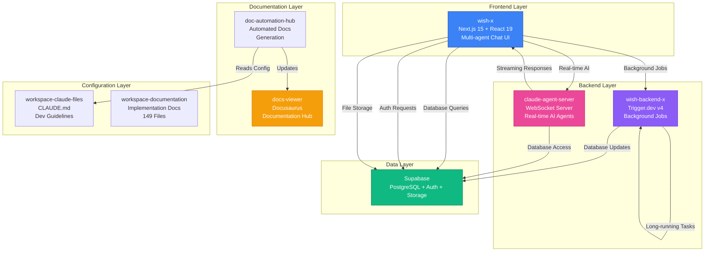
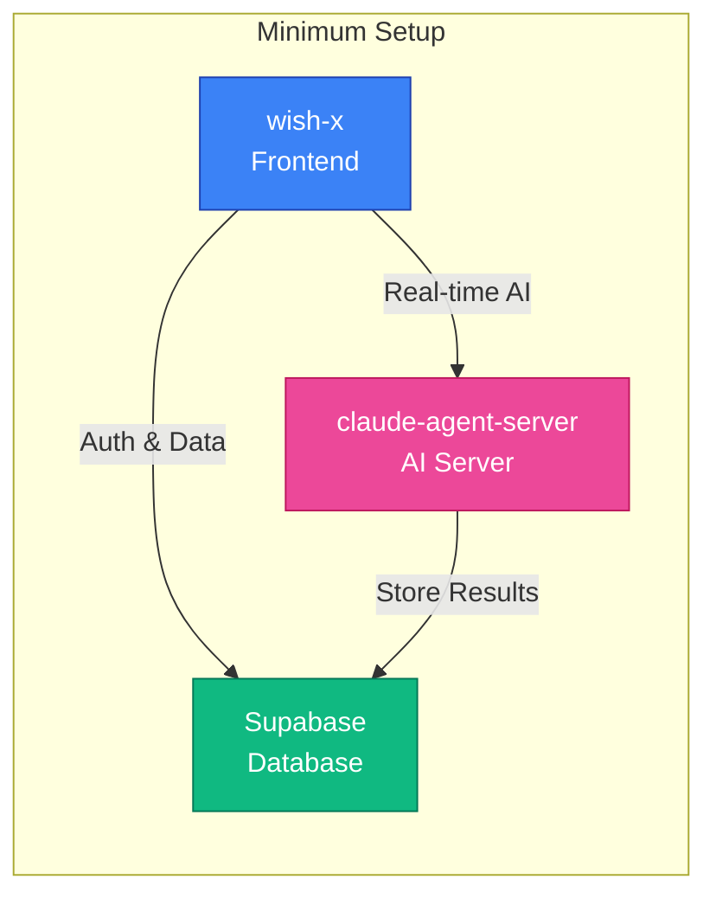
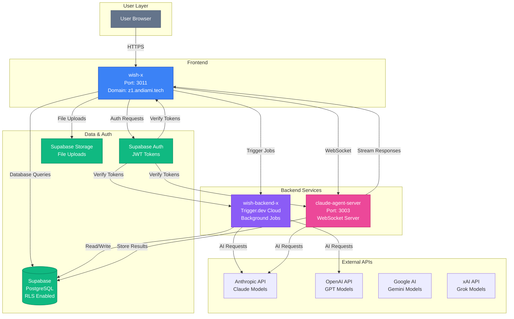
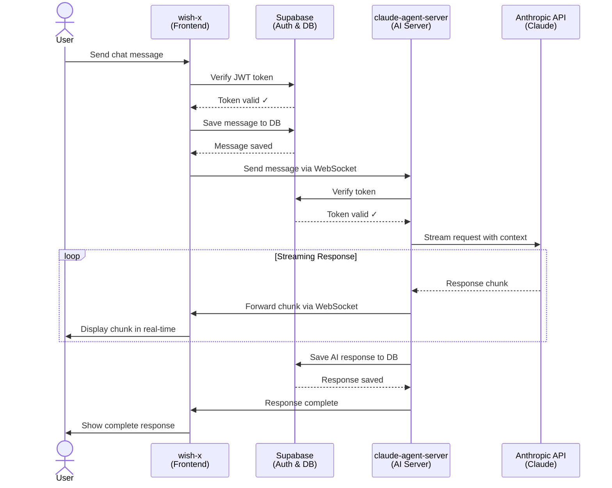
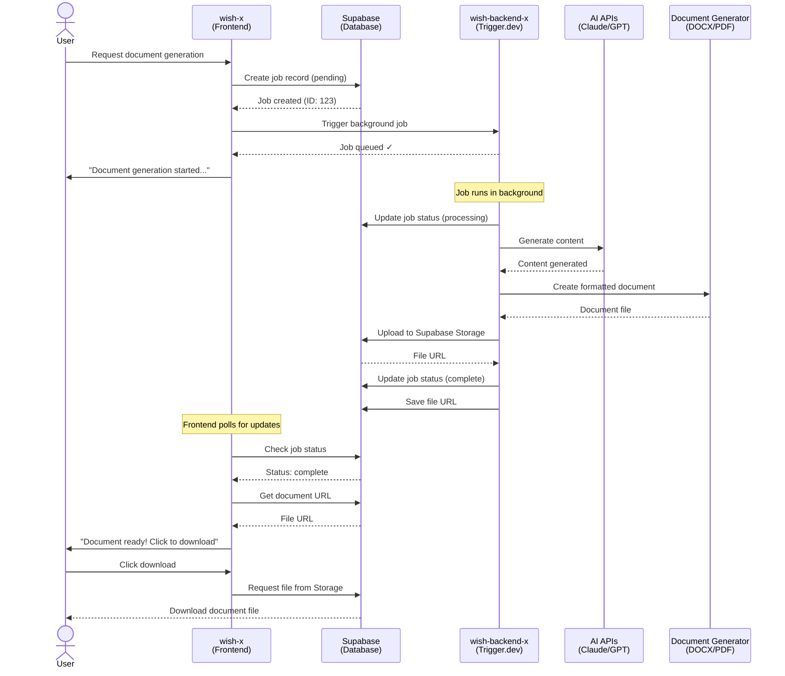
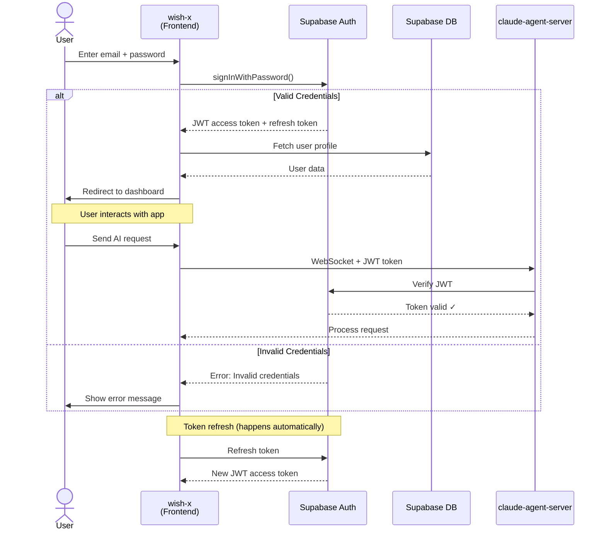
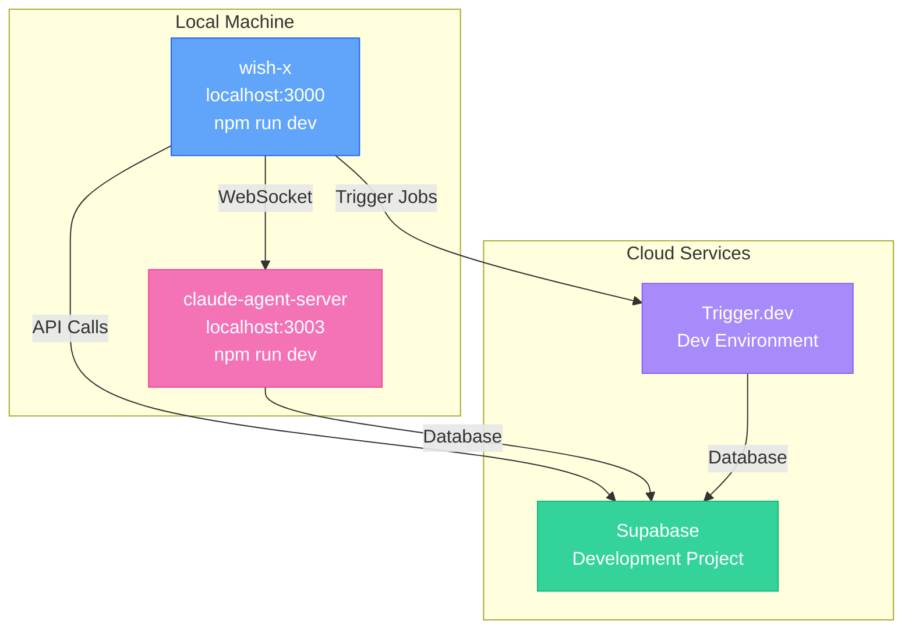
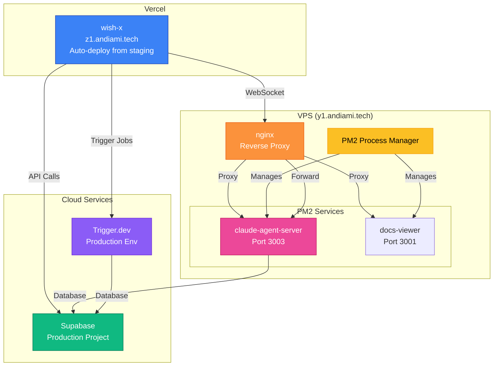

# System Architecture

Understanding how the As You Wish Ecosystem components work together is essential for effective development and deployment.

---

## 🏗️ High-Level Architecture

The As You Wish Ecosystem follows a modern, layered architecture with clear separation of concerns:



---

## 🔗 Component Relationships

### Core Components (Required for Basic Setup)



**What You Need:**
- ✅ **wish-x** - User interface for chat and workflows
- ✅ **claude-agent-server** - AI processing and streaming
- ✅ **Supabase** - Data persistence and authentication

**You Can Skip** (Optional Components):
- ⚠️ **wish-backend-x** - Only needed for background job processing
- ⚠️ **doc-automation-hub** - Only needed for automated documentation
- ⚠️ **docs-viewer** - Only needed to host documentation site

---

### Full System (Production Deployment)



---

## 🔄 Data Flow Diagrams

### User Request Flow (AI Chat)



---

### Background Job Flow (Document Generation)



---

### Authentication Flow



---

## 📦 Technology Stack by Component

### wish-x (Frontend)

| Layer | Technology | Purpose |
|-------|------------|---------|
| **Framework** | Next.js 15 (App Router) | Server-side rendering, routing |
| **UI Library** | React 19 | Component-based UI |
| **Language** | TypeScript | Type safety |
| **Styling** | Tailwind CSS v4 | Utility-first styling |
| **Components** | Radix UI | Accessible primitives |
| **State** | Zustand | Global state management |
| **Forms** | React Hook Form + Zod | Form handling + validation |
| **Editor** | TipTap | Rich text editing |
| **AI SDK** | Vercel AI SDK | AI model integration |
| **Auth** | Supabase Auth | User authentication |
| **Database** | Supabase Client | Database queries |

---

### wish-backend-x (Background Jobs)

| Layer | Technology | Purpose |
|-------|------------|---------|
| **Orchestration** | Trigger.dev v4 | Job scheduling & queueing |
| **Runtime** | Node.js | JavaScript runtime |
| **Language** | TypeScript | Type safety |
| **AI Integration** | Anthropic SDK, OpenAI SDK | AI model access |
| **Database** | Supabase Client | Data persistence |
| **Document Gen** | docx, PDFKit | DOCX/PDF creation |

---

### claude-agent-server (AI Server)

| Layer | Technology | Purpose |
|-------|------------|---------|
| **Framework** | Custom Node.js server | WebSocket handling |
| **Protocol** | WebSocket | Real-time bidirectional |
| **AI SDK** | Anthropic Claude SDK | Claude model access |
| **Database** | Supabase Client | Store conversations |
| **Auth** | Supabase Auth | Token verification |

---

### Supabase (Data Layer)

| Service | Technology | Purpose |
|---------|------------|---------|
| **Database** | PostgreSQL 15 | Relational data storage |
| **Auth** | Supabase Auth | JWT-based authentication |
| **Storage** | Supabase Storage | File uploads (S3-compatible) |
| **RLS** | Row Level Security | Data access control |
| **Real-time** | PostgreSQL LISTEN/NOTIFY | Live data updates |

---

## 🚀 Deployment Architecture

### Development Environment



---

### Production Environment



---

## 📋 Minimum Setup Requirements

### Option 1: Frontend Only (Quickest Start)

**Time:** 30-60 minutes

**Components:**
- ✅ wish-x (Frontend)
- ✅ claude-agent-server (AI Server)
- ✅ Supabase (Database + Auth)

**What You Get:**
- Multi-agent chat interface
- Real-time AI streaming responses
- User authentication
- Chat history storage

**What You DON'T Get:**
- Background job processing
- Document generation
- Automated documentation

**Best For:**
- Learning the system
- Building chat-based AI applications
- Prototyping AI interactions

---

### Option 2: Full System (Production Ready)

**Time:** 2-4 hours

**Components:**
- ✅ wish-x (Frontend)
- ✅ wish-backend-x (Background Jobs)
- ✅ claude-agent-server (AI Server)
- ✅ Supabase (Database + Auth)
- ✅ docs-viewer (Documentation - optional)
- ✅ doc-automation-hub (Auto-docs - optional)

**What You Get:**
- Everything from Option 1, PLUS:
- Background job processing
- Long-running AI tasks
- Document generation (PDF, DOCX)
- Automated documentation
- Complete production setup

**Best For:**
- Production deployment
- Complex AI workflows
- Document automation
- Team collaboration

---

## 🔐 Security Architecture

### Authentication Flow

```mermaid
graph TB
    subgraph "Client Side"
        A[User Browser<br/>JWT in localStorage]
    end

    subgraph "Supabase Auth"
        B[Auth Service<br/>JWT Signing]
        C[Token Verification]
    end

    subgraph "Application Layer"
        D[wish-x<br/>SUPABASE_ANON_KEY]
        E[wish-backend-x<br/>SERVICE_ROLE_KEY]
        F[claude-agent-server<br/>Verify JWT]
    end

    subgraph "Data Layer"
        G[(PostgreSQL<br/>RLS Enabled)]
    end

    A -->|Login| B
    B -->|JWT Token| A
    A -->|Requests + JWT| D
    D -->|Verify| C
    C -->|Valid| D

    D -->|RLS Query<br/>auth.uid()| G
    E -->|Bypass RLS<br/>Service Role| G
    F -->|Verify JWT| C
    F -->|RLS Query| G

    style A fill:#64748b,stroke:#475569,color:#fff
    style B fill:#10b981,stroke:#047857,color:#fff
    style C fill:#10b981,stroke:#047857,color:#fff
    style D fill:#3b82f6,stroke:#1e40af,color:#fff
    style E fill:#8b5cf6,stroke:#6d28d9,color:#fff
    style F fill:#ec4899,stroke:#be185d,color:#fff
    style G fill:#10b981,stroke:#047857,color:#fff
```

**Security Layers:**

| Layer | Protection | Implementation |
|-------|------------|----------------|
| **Transport** | HTTPS/WSS | TLS encryption |
| **Authentication** | JWT tokens | Supabase Auth |
| **Authorization** | Row Level Security (RLS) | PostgreSQL policies |
| **Input Validation** | Zod schemas | Client & server validation |
| **API Keys** | Environment variables | Never committed to git |
| **CORS** | Origin restrictions | Configured per environment |

---

## 📊 Scalability Considerations

### Current Limits (Single Server)

| Component | Current Limit | Scaling Strategy |
|-----------|---------------|------------------|
| **wish-x** | Vercel auto-scaling | Automatic (edge network) |
| **claude-agent-server** | ~100 concurrent WebSockets | Add load balancer + multiple instances |
| **wish-backend-x** | Trigger.dev handles scaling | Automatic (managed service) |
| **Supabase** | Free tier: 500MB DB | Upgrade to paid tier ($25/month for 8GB) |

---

### Scaling Paths

**Stage 1: Single Server (Current)**
- 1-100 users
- Single PM2 instance per service
- Supabase free tier
- Cost: $10-50/month

**Stage 2: Load Balanced**
- 100-1,000 users
- Multiple claude-agent-server instances
- nginx load balancer
- Supabase Pro tier
- Cost: $100-300/month

**Stage 3: Distributed**
- 1,000-10,000 users
- Kubernetes cluster
- Redis for session management
- Supabase Team tier
- CDN for static assets
- Cost: $500-2,000/month

---

## 🔍 Monitoring & Observability

### Key Metrics to Track

**Frontend (wish-x):**
- Page load time (target: <2 seconds)
- Time to first byte (TTFB)
- Core Web Vitals (LCP, FID, CLS)
- JavaScript error rate

**Backend (wish-backend-x):**
- Job completion rate
- Average job duration
- Failed job count
- Queue depth

**AI Server (claude-agent-server):**
- WebSocket connection count
- Message latency
- Error rate
- AI API response time

**Database (Supabase):**
- Query performance
- Connection pool usage
- Storage usage
- Active user count

---

## 🛠️ Troubleshooting Guide

### Common Issues

**Issue: wish-x shows "Unable to connect to server"**
```
Check:
1. Is claude-agent-server running? (pm2 list)
2. Is WebSocket URL correct in .env?
3. Is nginx proxying WebSocket correctly?
```

**Issue: Background jobs not processing**
```
Check:
1. Is Trigger.dev deployed? (npx trigger.dev deploys list)
2. Are env vars set correctly?
3. Check Trigger.dev dashboard for errors
```

**Issue: Authentication fails**
```
Check:
1. Are Supabase keys correct in .env?
2. Is Supabase RLS policy allowing access?
3. Is JWT token expired? (check browser localStorage)
```

---

## 📚 Related Documentation

- [wish-x Setup Guide](./wish-x) - Frontend development
- [wish-backend-x Setup Guide](./wish-backend-x) - Background job configuration
- [claude-agent-server Setup Guide](./claude-agent-server) - AI server deployment
- [Supabase Configuration](./workspace-claude-files/docs/03-development/supabase-config.md) - Database setup
- [Deployment Workflow](./workspace-claude-files/docs/05-deployment/deployment-workflow.md) - Production deployment

---

**Questions about architecture?** Check the [workspace-claude-files](./workspace-claude-files) for detailed development guidelines, or explore [workspace-documentation](./workspace-documentation) for implementation examples.
